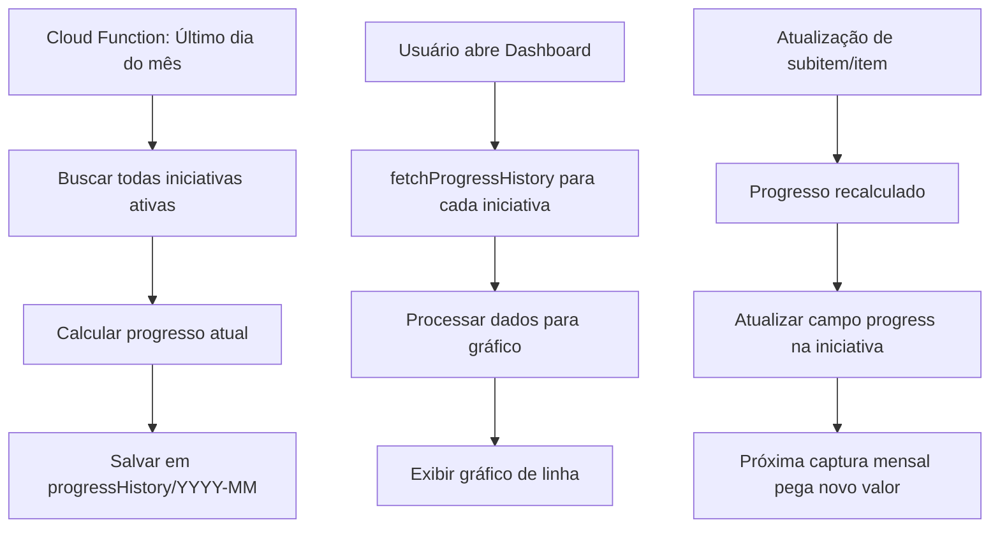

# Implementação de Histórico de Progresso Mensal de Iniciativas

## Objetivo

Criar um sistema que capture automaticamente o progresso de cada iniciativa no último dia de cada mês e forneça visualização em gráfico de linha no dashboard para identificar estagnação de progresso.

## Arquitetura

### 1. Estrutura de Dados

#### Novo tipo no Firestore

Criar subcollection `progressHistory` em cada documento de `initiatives`:

- Document ID: `YYYY-MM` (ex: `2024-01`)
- Campos:
  - `progress`: number (0-100)
  - `capturedAt`: timestamp ( b7hy bygTimestamp)
  - `month`: string (formato 'YYYY-MM')

#### Atualização do tipo TypeScript

Adicionar em `src/types/index.ts`:

```typescript
export interface InitiativeProgressHistory {
  month: string; // 'YYYY-MM'
  progress: number; // 0-100
  capturedAt: Date | string;
}

// Adicionar campo opcional em Initiative (para cache local)
export interface Initiative {
  // ... campos existentes
  progressHistory?: InitiativeProgressHistory[];
}
```

### 2. Captura Automática

#### Opção A: Cloud Function (Recomendado)

Criar Cloud Function `captureMonthlyProgress` agendada para rodar no último dia de cada mês às 23:59:

- Buscar todas as iniciativas ativas (não arquivadas)
- Calcular progresso atual usando `calculateProgressFromItems`
- Salvar em `initiatives/{initiativeId}/progressHistory/{YYYY-MM}`
- Usar merge para evitar duplicatas

#### Opção B: Job no cliente (alternativa)

- Criar hook `useMonthlyProgressCapture` que verifica no mount se já capturou o mês atual
- Capturar automaticamente quando detectar que é o último dia do mês

**Decisão:** Implementar Opção A (Cloud Function) para garantir execução mesmo sem usuários logados.

### 3. Visualização no Dashboard

#### Componente de Gráfico

Criar `src/components/initiatives/progress-history-chart.tsx`:

- Usar biblioteca de gráficos (ex: `recharts` ou `chart.js`)
- Gráfico de linha mostrando progresso ao longo dos meses
- Eixos: X (meses), Y (0-100%)
- Indicadores visuais para meses sem progresso (destaque em vermelho/laranja)

#### Integração no Dashboard

Atualizar `src/components/initiatives/initiatives-dashboard.tsx`:

- Adicionar seção "Evolução de Progresso" 
- Mostrar gráfico com todas as iniciativas filtradas
- Permitir selecionar iniciativa específica para ver histórico individual
- Mostrar alerta para iniciativas que não progrediram no último mês

#### Componente Card Individual (opcional)

Atualizar `src/components/dashboard/initiative-card.tsx`:

- Adicionar pequeno gráfico inline (últimos 6 meses)
- Ou botão para expandir e ver histórico completo

### 4. Context e Hooks

#### Atualizar InitiativesContext

Em `src/contexts/initiatives-context.tsx`:

- Adicionar função `fetchProgressHistory(initiativeId: string)` para buscar histórico
- Adicionar função `captureMonthlyProgress(initiativeId: string)` para captura manual (opcional)
- Cachear histórico no estado local

#### Novo Hook

Criar `src/hooks/use-progress-history.ts`:

- Hook personalizado para buscar e formatar histórico de progresso
- Processar dados para gráfico
- Identificar meses sem progresso

### 5. Regras de Segurança Firestore

Atualizar `firestore.rules`:

```javascript
match /initiatives/{initiativeId}/progressHistory/{month} {
  allow read: if request.auth != null;
  allow write: if request.auth != null && 
    (request.auth.token.userType == 'admin' || 
     request.auth.token.userType == 'pmo');
}
```

### 6. Função de Captura Manual (Fallback)

Criar endpoint/action para captura manual:

- Botão admin para "Capturar Progresso do Mês Atual"
- Útil se Cloud Function falhar
- Registrar em log de auditoria

## Fluxo de Dados



## Arquivos a Criar/Modificar

### Novos Arquivos

1. `src/types/index.ts` - Adicionar `InitiativeProgressHistory`
2. `src/components/initiatives/progress-history-chart.tsx` - Componente de gráfico
3. `src/hooks/use-progress-history.ts` - Hook para histórico
4. `functions/src/capture-monthly-progress.ts` - Cloud Function (se usar Firebase Functions)

### Arquivos a Modificar

1. `src/types/index.ts` - Atualizar interface `Initiative`
2. `src/contexts/initiatives-context.tsx` - Adicionar funções de histórico
3. `src/components/initiatives/initiatives-dashboard.tsx` - Adicionar seção de histórico
4. `firestore.rules` - Adicionar regras para subcollection
5. `package.json` - Adicionar dependência de gráficos (recharts)

## Validação e Testes

1. Testar captura automática no último dia do mês
2. Verificar que não duplica registros do mesmo mês
3. Testar visualização com 0, 1, múltiplos meses de histórico
4. Validar identificação de meses sem progresso
5. Testar performance com muitas iniciativas

## Considerações de Segurança

- Regras Firestore restringindo escrita apenas para admin/PMO
- Validação de dados (progress entre 0-100)
- Rate limiting na captura manual (se implementada)
- Logs de auditoria para capturas manuais

## Dependências Necessárias

- `recharts` ou `@tanstack/react-charts` (para gráficos)
- Firebase Functions (se usar Cloud Function)

## Próximos Passos (Futuro)

- Notificações para iniciativas estagnadas
- Export de relatórios em PDF/Excel
- Comparação entre iniciativas
- Previsão de conclusão baseada em tendência