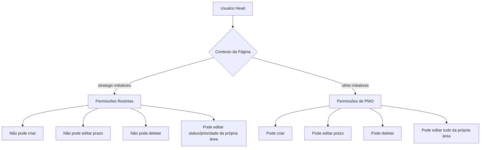
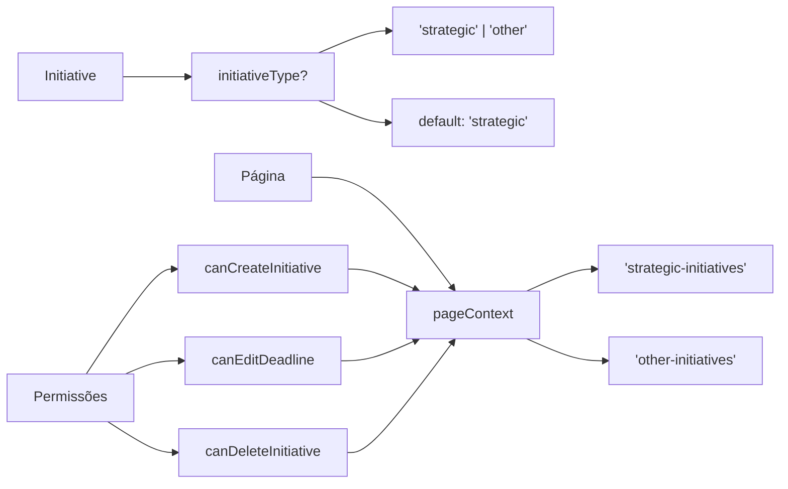

# Implementação: Outras Iniciativas com Permissões Especiais

## Objetivo

Criar uma nova camada "Outras Iniciativas" onde o usuário tipo `head` terá permissões de `pmo` (criar, editar, deletar, editar prazos), enquanto mantém restrições normais em "Iniciativas Estratégicas".

## Decisões Técnicas Confirmadas

1. **Campo `initiativeType`**: Adicionar ao tipo `Initiative` com valores `'strategic' | 'other'` (default `'strategic'` para compatibilidade)
2. **Migração de dados**: Iniciativas existentes serão marcadas como `'strategic'` automaticamente
3. **Filtro de área**: Head vê apenas sua própria área em "Outras Iniciativas"
4. **Agenda**: Mostrar ambas com flag indicando o tipo, usando tabs para alternar
5. **Reutilização**: Mesmos componentes, apenas mudando filtros e contexto de permissões

## Arquitetura

### Fluxo de Permissões por Contexto



### Estrutura de Dados



## Implementação

### 1. Tipos e Interfaces

**Arquivo**: `src/types/index.ts`

- Adicionar campo opcional `initiativeType?: 'strategic' | 'other'` na interface `Initiative`
- Manter compatibilidade retroativa (campo opcional, default `'strategic'`)

### 2. Sistema de Permissões

**Arquivo**: `src/lib/permissions-config.ts`

- Adicionar tipo `InitiativePageContext = 'strategic-initiatives' | 'other-initiatives'`
- Adicionar `PAGE_KEYS.OTHER_INITIATIVES = 'other-initiatives'`
- Atualizar `DEFAULT_PERMISSIONS_BY_ROLE` para incluir `other-initiatives` para todos os tipos
- Modificar funções para aceitar `pageContext?: InitiativePageContext`:
  - `canCreateInitiative(userType, pageContext?)`
  - `canEditDeadline(userType, pageContext?)`
  - `canDeleteInitiative(userType, pageContext?)`
  - `canImportInitiatives(userType, pageContext?)`
  - `canEditInitiativeStatus(userType, userArea, initiativeAreaId, pageContext?)`
  - `canEditInitiativeResponsible(userType, userArea, initiativeAreaId, pageContext?)`
  - `canEditDescription(userType, userArea, initiativeAreaId, pageContext?)`
  - `canEditPriority(userType, userArea, initiativeAreaId, pageContext?)`

**Lógica de permissões**:

- Head em `'other-initiatives'`: permissões de PMO (pode criar, editar prazo, deletar)
- Head em `'strategic-initiatives'`: permissões restritas (comportamento atual)
- Admin e PMO: sempre têm todas as permissões

### 3. Migração de Dados

**Opção 1: Migração automática no código**

**Arquivo**: `src/contexts/initiatives-context.tsx`

- Adicionar verificação em `fetchInitiatives` para adicionar `initiativeType: 'strategic'` apenas se o campo não existir
- Executar migração uma única vez ao carregar iniciativas
- Usar `updateDoc` para atualizar documentos sem `initiativeType` apenas na primeira execução
- Adicionar flag ou verificação para evitar migrações repetidas (ex: verificar se já existe `initiativeType` antes de atualizar)

**Opção 2: Script Python separado (recomendado para grandes volumes)**

- Criar script Python que:
  - Conecta ao Firestore
  - Busca todas as iniciativas sem `initiativeType`
  - Atualiza em lote adicionando `initiativeType: 'strategic'`
  - Executa uma única vez antes do deploy
- Vantagem: não impacta performance do carregamento inicial
- Desvantagem: requer execução manual

**Recomendação**: Usar Opção 1 para simplicidade, ou Opção 2 se houver muitas iniciativas (milhares+)

### 4. Nova Página: Outras Iniciativas

**Arquivo**: `src/app/(app)/other-initiatives/page.tsx` (NOVO)

- Copiar estrutura de `strategic-initiatives/page.tsx`
- Filtrar iniciativas por `initiativeType === 'other'` (ou `initiativeType` undefined/null tratado como `'strategic'`)
- Passar `pageContext: 'other-initiatives'` para todas as funções de permissão
- Área padrão: sempre área do head (não "Estratégia e IA")
- Título: "Outras Iniciativas"
- Reutilizar todos os componentes existentes (Dashboard, Tabela/Gantt, Kanban)

### 5. Modificação da Agenda

**Arquivo**: `src/app/(app)/agenda/page.tsx`

- Adicionar import de `Tabs, TabsList, TabsTrigger, TabsContent`
- Adicionar estado `activeTab: 'strategic' | 'other'`
- **Filtrar iniciativas por `initiativeType` ANTES de chamar `getWeekItems`**:
  - Criar `filteredInitiatives` que filtra por `initiativeType` baseado na aba ativa
  - Passar `filteredInitiatives` para `getWeekItems` (não todas as iniciativas)
  - Tratar `initiativeType` undefined/null como `'strategic'`
- Passar `pageContext` para `canEditInitiativeStatus` baseado na aba ativa
- Renderizar conteúdo dentro de `TabsContent` para cada aba
- Adicionar flag/indicador visual do tipo de iniciativa na tabela (opcional, via `AgendaItem`)

**Arquivo**: `src/lib/agenda-helpers.ts`

- Manter `getWeekItems` como está (não precisa modificar)
- O filtro por `initiativeType` será feito na página antes de chamar `getWeekItems`

### 6. Componentes de Iniciativas

**Importante**: O componente `InitiativeForm` já recebe props de permissão (`canEditDeadline`, `canEditDescription`, `canEditPriority`, etc.) e não calcula permissões internamente. Os modais (`CreateInitiativeModal` e `EditInitiativeModal`) são responsáveis por calcular essas props usando `pageContext` e passá-las para `InitiativeForm`.

**Arquivo**: `src/components/initiatives/create-initiative-modal.tsx`

- Adicionar prop `pageContext?: InitiativePageContext`
- **Calcular props de permissão usando `pageContext`** antes de passar para `InitiativeForm`:
  - `canCreateInitiative(userType, pageContext)`
  - `canEditDeadline(userType, pageContext)`
- Passar essas props calculadas para `InitiativeForm` (que já recebe essas props)
- Definir `initiativeType` ao criar iniciativa baseado no `pageContext`:
  - Se `pageContext === 'other-initiatives'`: `initiativeType: 'other'`
  - Se `pageContext === 'strategic-initiatives'` ou undefined: `initiativeType: 'strategic'`

**Arquivo**: `src/components/initiatives/edit-initiative-modal.tsx`

- Adicionar prop `pageContext?: InitiativePageContext`
- Passar `pageContext` para todas as funções de permissão:
  - `canEditInitiativeStatus`
  - `canDeleteInitiative`
  - `canEditDeadline`
  - `canEditDescription`
  - `canEditPriority`

**Arquivo**: `src/components/initiatives/initiatives-kanban.tsx`

- Adicionar prop `pageContext?: InitiativePageContext`
- Passar `pageContext` para `canEditInitiativeStatus` (3 ocorrências)

**Arquivo**: `src/app/(app)/strategic-initiatives/page.tsx`

- Passar `pageContext: 'strategic-initiatives'` para todas as chamadas de permissão
- Passar `pageContext` para modais (`CreateInitiativeModal`, `EditInitiativeModal`)
- Passar `pageContext` para `InitiativesKanban`

### 7. Navegação

**Arquivo**: `src/lib/constants.ts`

- Adicionar item em `NAV_ITEMS_CONFIG`:
  ```typescript
  { title: 'Outras Iniciativas', href: '/other-initiatives', icon: FileText }
  ```

- Adicionar em `PAGE_PERMISSIONS_MAP`:
  ```typescript
  'Outras Iniciativas': 'other-initiatives'
  ```

- Adicionar em `PERMISSIONABLE_PAGES`:
  ```typescript
  { title: 'Outras Iniciativas', key: 'other-initiatives' }
  ```


**Arquivo**: `src/lib/permissions-config.ts`

- Adicionar `OTHER_INITIATIVES: 'other-initiatives'` em `PAGE_KEYS`
- Adicionar `'other-initiatives'` em `DEFAULT_PERMISSIONS_BY_ROLE` para todos os tipos de usuário
- **Nota**: A visibilidade do item de navegação será controlada automaticamente por `hasPermission()` no `SidebarNav`, que já verifica `DEFAULT_PERMISSIONS_BY_ROLE`

### 8. Contexto de Iniciativas

**Arquivo**: `src/contexts/initiatives-context.tsx`

- Modificar `addInitiative` para aceitar `initiativeType` opcional no `InitiativeFormData`
- Se não fornecido, usar `'strategic'` como default
- Garantir que `initiativeType` seja salvo no Firestore ao criar/atualizar

## Arquivos a Modificar

1. `src/types/index.ts` - Adicionar campo `initiativeType`
2. `src/lib/permissions-config.ts` - Adicionar contexto e atualizar funções
3. `src/contexts/initiatives-context.tsx` - Migração e suporte a `initiativeType`
4. `src/app/(app)/other-initiatives/page.tsx` - NOVA PÁGINA
5. `src/app/(app)/strategic-initiatives/page.tsx` - Passar `pageContext`
6. `src/app/(app)/agenda/page.tsx` - Adicionar tabs e filtro por tipo
7. `src/components/initiatives/create-initiative-modal.tsx` - Receber e usar `pageContext`
8. `src/components/initiatives/edit-initiative-modal.tsx` - Receber e usar `pageContext`
9. `src/components/initiatives/initiatives-kanban.tsx` - Receber e usar `pageContext`
10. `src/lib/constants.ts` - Adicionar item de navegação, PAGE_PERMISSIONS_MAP e PERMISSIONABLE_PAGES

## Validações

- Head pode criar/editar/deletar em "Outras Iniciativas" ✅
- Head não pode criar em "Iniciativas Estratégicas" ✅
- Head pode editar prazos em "Outras Iniciativas" ✅
- Head vê apenas sua própria área em "Outras Iniciativas" ✅
- Componentes reutilizados sem duplicação ✅
- Filtro por tipo funcionando corretamente ✅
- Migração de dados executada automaticamente ✅
- Agenda mostra ambas com tabs funcionando ✅

## Ordem de Implementação

1. Tipos e interfaces (`initiativeType`)
2. Sistema de permissões (`pageContext`)
3. Migração de dados
4. Nova página "Outras Iniciativas"
5. Atualizar página "Iniciativas Estratégicas"
6. Modificar Agenda com tabs
7. Atualizar componentes (modais, kanban)
8. Adicionar navegação
9. Testes e validação