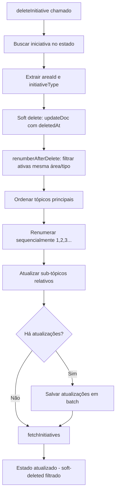

# Numeração de Iniciativas por Área e Tipo (com Soft Delete)

## Objetivo

Alterar a numeração de iniciativas para ser sequencial por área de negócio e tipo (strategic/other), em vez de global. Cada área/tipo deve ter sua própria sequência começando em 1. A renumeração após deleção foi ajustada para trabalhar com soft delete (campo `deletedAt`).

## Situação Atual

### Estrutura de Numeração

- `topicNumber` é gerado globalmente via `getNextMainTopicNumber()` em [src/contexts/initiatives-context.tsx](src/contexts/initiatives-context.tsx:466-469)
- Não considera `areaId` nem `initiativeType`
- Sub-tópicos usam formato hierárquico: "1", "1.1", "1.1.1" (baseado em `parentId`)

### Soft Delete Implementado

- Iniciativas não são mais deletadas fisicamente
- Campo `deletedAt` marca iniciativas como deletadas
- `fetchInitiatives()` filtra automaticamente iniciativas com `deletedAt` (linha 355)
- `deleteInitiative()` faz `updateDoc` com `deletedAt` em vez de `deleteDoc` (linha 750-752)

### Hierarquia

- Tópicos principais: `topicNumber` sem pontos (ex: "1", "2")
- Sub-tópicos: `topicNumber` com pontos (ex: "1.1", "1.2")
- Relacionamento: `parentId` conecta Initiatives filhas ao pai
- UI identifica sub-tópicos via `topicNumber.includes('.')`

## Mudanças Necessárias

### 0. Adicionar Campo `createdAt` na Interface

**Arquivo:** [src/types/index.ts](src/types/index.ts)

Adicionar campo opcional `createdAt` na interface `Initiative` para novas iniciativas:

```typescript
export interface Initiative {
  id: string;
  topicNumber: string;
  parentId?: string | null;
  title: string;
  status: InitiativeStatus;
  owner: string;
  description: string;
  lastUpdate: string;
  createdAt?: string; // ISO date string - adicionado para novas iniciativas
  progress: number;
  priority: InitiativePriority;
  startDate: string;
  endDate: string;
  keyMetrics: { name: string; value: string; trend: 'up' | 'down' | 'neutral' }[];
  icon?: React.ElementType;
  areaId: string;
  items: InitiativeItem[];
  archived?: boolean;
  deletedAt?: string;
  initiativeType?: 'strategic' | 'other';
  cidade?: string;
  auc?: number;
  subItems?: SubItem[];
}
```

**Nota:** Campo é opcional para manter compatibilidade com iniciativas antigas que não possuem `createdAt`.

**Uso futuro:** O campo `createdAt` será usado como critério de ordenação secundário na função `renumberAfterDelete()` quando disponível, permitindo ordenação cronológica mais precisa. Por enquanto, é adicionado apenas para registro histórico e será utilizado quando todas as iniciativas tiverem esse campo.

### 1. Nova Função de Numeração

**Arquivo:** [src/contexts/initiatives-context.tsx](src/contexts/initiatives-context.tsx)

Criar `getNextTopicNumberForArea()` que:

- Filtra iniciativas por `areaId` e `initiativeType`
- **Exclui iniciativas com `deletedAt`** (soft-deleted)
- Considera apenas tópicos principais (sem pontos)
- Retorna próximo número sequencial para aquela combinação área/tipo
```typescript
const getNextTopicNumberForArea = (
  currentInitiatives: Initiative[], 
  areaId: string, 
  initiativeType: 'strategic' | 'other'
): number => {
  const filtered = currentInitiatives.filter(i => 
    !i.deletedAt && // Excluir soft-deleted
    i.areaId === areaId && 
    (i.initiativeType || 'strategic') === initiativeType &&
    !i.topicNumber.includes('.')
  );
  
  if (filtered.length === 0) return 1;
  
  const numbers = filtered
    .map(i => parseInt(i.topicNumber))
    .filter(n => !isNaN(n) && n > 0);
  
  return numbers.length > 0 ? Math.max(...numbers) + 1 : 1;
};
```


### 2. Atualizar `addInitiative()`

**Arquivo:** [src/contexts/initiatives-context.tsx](src/contexts/initiatives-context.tsx:471-549)

Substituir chamada a `getNextMainTopicNumber()` por `getNextTopicNumberForArea()` e adicionar `createdAt`:

- Linha ~476: usar nova função com `areaId` e `initiativeType` do formulário
- Linha ~478: adicionar `createdAt: new Date().toISOString()` ao criar nova iniciativa
```typescript
const newInitiative = {
    title: initiativeData.title,
    owner: initiativeData.owner,
    description: initiativeData.description,
    status: initiativeData.status,
    priority: initiativeData.priority,
    startDate: initiativeData.startDate ? (typeof initiativeData.startDate === 'string' ? initiativeData.startDate : initiativeData.startDate.toISOString().split('T')[0]) : '',
    endDate: initiativeData.endDate ? (typeof initiativeData.endDate === 'string' ? initiativeData.endDate : initiativeData.endDate.toISOString().split('T')[0]) : '',
    areaId: initiativeData.areaId,
    initiativeType: (initiativeData as any).initiativeType || 'strategic',
    lastUpdate: new Date().toISOString(),
    createdAt: new Date().toISOString(), // Adicionar para novas iniciativas
    topicNumber: nextTopicNumber,
    progress: 0,
    keyMetrics: [],
    parentId: null,
    archived: false,
    items: initiativeData.items?.map(p => ({
        // ... resto do código
    })) || [],
};
```


### 3. Atualizar `bulkAddInitiatives()`

**Arquivo:** [src/contexts/initiatives-context.tsx](src/contexts/initiatives-context.tsx:562-689)

Modificar para:

- Agrupar iniciativas por área/tipo antes de processar
- Calcular `nextTopicNumber` separadamente para cada grupo
- Manter sequência correta dentro de cada grupo
- **Usar `getNextTopicNumberForArea()` para cada grupo** (já exclui soft-deleted automaticamente)
- Adicionar `createdAt: new Date().toISOString()` ao criar cada iniciativa em bulk

**Implementação do agrupamento:**

```typescript
const bulkAddInitiatives = useCallback(async (newInitiativesData: Array<{...}>) => {
  // Agrupar iniciativas por área/tipo antes de processar
  const groupedByAreaType = newInitiativesData.reduce((acc, init) => {
    const areaId = init.areaId;
    const initiativeType = (init as any).initiativeType || 'strategic';
    const key = `${areaId}_${initiativeType}`;
    
    if (!acc[key]) {
      acc[key] = {
        areaId,
        initiativeType: initiativeType as 'strategic' | 'other',
        initiatives: []
      };
    }
    acc[key].initiatives.push(init);
    return acc;
  }, {} as Record<string, { areaId: string; initiativeType: 'strategic' | 'other'; initiatives: typeof newInitiativesData }>);

  const batch = writeBatch(db);
  
  // Processar cada grupo com sua própria sequência
  for (const [key, group] of Object.entries(groupedByAreaType)) {
    const { areaId, initiativeType, initiatives: groupInitiatives } = group;
    
    // Calcular próximo número para este grupo
    let nextTopicNumber = getNextTopicNumberForArea(initiatives, areaId, initiativeType);
    
    groupInitiatives.forEach(initiativeData => {
      // Validar que a iniciativa tem pelo menos 1 item
      if (!initiativeData.items || initiativeData.items.length === 0) {
        console.error(`Iniciativa "${initiativeData.title}" não possui itens. Será ignorada.`);
        return;
      }

      // ... validação e formatação de datas (código existente) ...

      const newInitiative = {
        title: initiativeData.title,
        owner: initiativeData.owner,
        description: initiativeData.description || '',
        status: initiativeData.status,
        priority: initiativeData.priority,
        startDate: startDate,
        endDate: endDate,
        areaId: initiativeData.areaId,
        initiativeType: initiativeType,
        lastUpdate: new Date().toISOString(),
        createdAt: new Date().toISOString(), // Adicionar para novas iniciativas
        topicNumber: (nextTopicNumber++).toString(), // Incrementar para cada iniciativa do grupo
        progress: 0,
        keyMetrics: [],
        parentId: null,
        items: items,
        archived: false,
      };
      
      const cleanedInitiative = removeUndefinedFields(newInitiative);
      const docRef = doc(initiativesCollectionRef);
      batch.set(docRef, cleanedInitiative);
    });
  }

  try {
    await batch.commit();
    fetchInitiatives();
  } catch (error) {
    console.error("Error bulk adding initiatives: ", error);
  }
}, [initiatives, fetchInitiatives, initiativesCollectionRef]);
```

### 4. Função de Reordenação Após Soft Delete

**Arquivo:** [src/contexts/initiatives-context.tsx](src/contexts/initiatives-context.tsx)

Criar `renumberAfterDelete()` que:

- Recebe `areaId` e `initiativeType` da iniciativa soft-deletada
- **Filtra apenas iniciativas ativas (sem `deletedAt`)** da mesma área/tipo
- Renumera tópicos principais sequencialmente (1, 2, 3...)
- Atualiza sub-tópicos relativos ao novo número do pai
- Retorna array de atualizações `{ id, topicNumber }`

**Estratégia (ajustada para soft delete):**

1. Receber `areaId` e `initiativeType` da iniciativa soft-deletada (ainda disponível no estado)
2. Filtrar iniciativas ativas (`!deletedAt`) da mesma área/tipo
3. Separar tópicos principais e sub-tópicos
4. Ordenar tópicos principais pelo `topicNumber` atual
5. Renumerar sequencialmente começando em 1
6. Criar mapa `topicNumber antigo → novo` para tópicos principais
7. Reconstruir `topicNumber` de sub-tópicos usando novo número do pai
```typescript
const renumberAfterDelete = (
  deletedInitiative: { areaId: string; initiativeType?: 'strategic' | 'other' },
  allInitiatives: Initiative[]
): Array<{ id: string; topicNumber: string }> => {
  const initiativeType = deletedInitiative.initiativeType || 'strategic';
  
  // Filtrar apenas iniciativas ATIVAS (sem deletedAt) da mesma área/tipo
  const activeSameAreaType = allInitiatives.filter(i => 
    !i.deletedAt && // Apenas ativas
    i.areaId === deletedInitiative.areaId &&
    (i.initiativeType || 'strategic') === initiativeType
  );
  
  if (activeSameAreaType.length === 0) return [];
  
  // Separar tópicos principais e sub-tópicos
  const mainTopics = activeSameAreaType.filter(i => !i.topicNumber.includes('.'));
  const subTopics = activeSameAreaType.filter(i => i.topicNumber.includes('.'));

  // Ordenar tópicos principais: usar createdAt se ambos tiverem, senão fallback para topicNumber
  // Isso permite ordenação cronológica mais precisa quando disponível, mantendo compatibilidade
  // com iniciativas antigas que não possuem createdAt
  mainTopics.sort((a, b) => {
    // Priorizar createdAt quando ambos tiverem (ordenação cronológica)
    if (a.createdAt && b.createdAt) {
      const aTime = new Date(a.createdAt).getTime();
      const bTime = new Date(b.createdAt).getTime();
      if (aTime !== bTime) {
        return aTime - bTime;
      }
    }
    // Fallback para topicNumber (preserva ordem atual para iniciativas antigas)
    const aNum = parseInt(a.topicNumber) || 0;
    const bNum = parseInt(b.topicNumber) || 0;
    return aNum - bNum;
  });
  
  // Criar mapa de renumeração
  const topicNumberMap = new Map<string, string>();
  const updates: Array<{ id: string; topicNumber: string }> = [];
  
  mainTopics.forEach((init, index) => {
    const newNumber = (index + 1).toString();
    topicNumberMap.set(init.topicNumber, newNumber);
    updates.push({ id: init.id, topicNumber: newNumber });
  });
  
  // Atualizar sub-tópicos com validação de órfãos
  subTopics.forEach(init => {
    const parts = init.topicNumber.split('.');
    const parentOldNumber = parts[0];
    const parentNewNumber = topicNumberMap.get(parentOldNumber);
    
    // Validação crucial: verificar se o pai existe no mapa de renumeração
    if (!parentNewNumber) {
      console.warn(`Sub-tópico ${init.id} tem pai órfão: topicNumber "${init.topicNumber}" referencia pai "${parentOldNumber}" que não foi encontrado. Sub-tópico será pulado na renumeração.`);
      return; // Pula este sub-tópico para evitar numeração inconsistente
    }
    
    // Reconstruir topicNumber com novo número do pai
    const newTopicNumber = [parentNewNumber, ...parts.slice(1)].join('.');
    updates.push({ id: init.id, topicNumber: newTopicNumber });
  });
  
  return updates;
};
```


### 5. Atualizar `deleteInitiative()`

**Arquivo:** [src/contexts/initiatives-context.tsx](src/contexts/initiatives-context.tsx:746-754)

Modificar para:

1. Buscar iniciativa no estado atual (ainda disponível, não foi deletada fisicamente)
2. Extrair `areaId` e `initiativeType`
3. Fazer soft delete (já implementado: `updateDoc` com `deletedAt`)
4. Chamar `renumberAfterDelete()` com dados da iniciativa e lista atual (que ainda contém a iniciativa, mas será filtrada pela função)
5. Aplicar atualizações de renumeração em batch
6. Chamar `fetchInitiatives()` para atualizar estado (já filtra soft-deleted automaticamente)

**Fluxo (ajustado para soft delete com transação):**

```typescript
import { runTransaction } from 'firebase/firestore';

const deleteInitiative = useCallback(async (initiativeId: string) => {
  // 1. Buscar iniciativa no estado (ainda disponível, não foi deletada fisicamente)
  const initiativeToDelete = initiatives.find(i => i.id === initiativeId);
  if (!initiativeToDelete) return;
  
  const { areaId, initiativeType } = initiativeToDelete;
  
  // 2. Calcular renumerações antes da transação
  const renumberUpdates = renumberAfterDelete(
    { areaId, initiativeType },
    initiatives // Lista atual, função filtra soft-deleted internamente
  );
  
  // 3. Usar transação para garantir atomicidade (evita race conditions)
  const initiativeDocRef = doc(db, 'initiatives', initiativeId);
  try {
    await runTransaction(db, async (transaction) => {
      // Soft delete da iniciativa
      transaction.update(initiativeDocRef, {
        deletedAt: new Date().toISOString(),
        lastUpdate: new Date().toISOString()
      });
      
      // Aplicar renumerações dentro da mesma transação
      if (renumberUpdates.length > 0) {
        renumberUpdates.forEach(({ id, topicNumber }) => {
          const docRef = doc(db, 'initiatives', id);
          transaction.update(docRef, { topicNumber });
        });
      }
    });
    
    // 4. Recarregar após transação bem-sucedida (já filtra soft-deleted automaticamente)
    await fetchInitiatives();
    
  } catch (error) {
    console.error("Error deleting initiative: ", error);
    // Transação garante que ou tudo é aplicado ou nada é aplicado
  }
}, [initiatives, fetchInitiatives]);
```

**Vantagens da transação:**

- Atomicidade: ou todas as mudanças são aplicadas ou nenhuma
- Evita race conditions em soft delete simultâneo
- Garante consistência dos dados mesmo com múltiplas operações

**Vantagens do soft delete para renumeração:**

- Iniciativa ainda está disponível no estado (não precisa buscar antes)
- Não precisa aguardar `fetchInitiatives()` completar para renumerar
- Pode renumerar imediatamente após soft delete
- `fetchInitiatives()` já filtra automaticamente, então estado sempre consistente

### 6. Script de Migração Inicial (Opcional)

**Arquivo:** `scripts/migrate-topic-numbers.py` (ou `.ts`)

Script standalone para executar migração uma única vez nos dados existentes:

**Funcionalidades:**

1. **Conexão ao Firestore:**

   - Usar credenciais do projeto Firebase
   - Conectar à coleção `initiatives`

2. **Carregamento de dados:**

   - Buscar todas as iniciativas (incluindo soft-deleted para contexto)
   - Ordenar por `topicNumber` atual

3. **Validações pré-migração:**

   - Verificar se há iniciativas para migrar
   - Mostrar resumo: quantidade por área/tipo
   - **Opção de dry-run** (simular sem salvar) - flag `--dry-run`

4. **Adicionar `createdAt` para iniciativas antigas:**

   - Para iniciativas sem `createdAt`, usar `lastUpdate` como base
   - Se `lastUpdate` não existir, usar timestamp atual da migração
   - Documentar no log quais iniciativas receberam `createdAt` baseado em `lastUpdate`

5. **Execução da migração:**

   - Agrupar iniciativas por `areaId` + `initiativeType`
   - Separar tópicos principais e sub-tópicos
   - Ordenar tópicos principais por `topicNumber` atual (ou `createdAt` se disponível)
   - Renumerar tópicos principais sequencialmente (1, 2, 3...)
   - Criar mapa `topicNumber antigo → novo` para tópicos principais
   - Reconstruir `topicNumber` de sub-tópicos usando novo número do pai
   - Validar sub-tópicos órfãos (pai não encontrado)

6. **Aplicação em batch:**

   - Dividir em chunks se necessário (limite Firestore: 500 por batch)
   - Aplicar atualizações em batches sequenciais
   - Validar sucesso de cada batch

7. **Logging e relatório:**

   - Log detalhado de cada mudança (antes → depois)
   - Relatório final: quantas iniciativas foram atualizadas
   - Relatório de `createdAt` adicionados
   - Relatório de sub-tópicos órfãos encontrados
   - Confirmação manual antes de executar (exceto dry-run)

**Estrutura do script (Python exemplo):**

```python
#!/usr/bin/env python3
"""
Script de migração de topicNumbers por área e tipo.
Executa uma única vez para converter numeração global em numeração por área/tipo.
Adiciona createdAt para iniciativas antigas baseado em lastUpdate.
"""

import firebase_admin
from firebase_admin import credentials, firestore
from collections import defaultdict
import sys
from datetime import datetime

def migrate_topic_numbers(dry_run=False):
    # 1. Inicializar Firebase
    if not firebase_admin._apps:
        cred = credentials.Certificate('path/to/serviceAccountKey.json')
        firebase_admin.initialize_app(cred)
    
    db = firestore.client()
    
    # 2. Carregar todas as iniciativas
    initiatives_ref = db.collection('initiatives')
    all_initiatives = [doc.to_dict() | {'id': doc.id} for doc in initiatives_ref.stream()]
    
    # 3. Adicionar createdAt para iniciativas antigas
    created_at_updates = []
    for init in all_initiatives:
        if 'createdAt' not in init or not init['createdAt']:
            # Usar lastUpdate se disponível, senão usar timestamp atual
            created_at = init.get('lastUpdate') or datetime.utcnow().isoformat()
            created_at_updates.append({
                'id': init['id'],
                'createdAt': created_at,
                'reason': 'lastUpdate' if init.get('lastUpdate') else 'migration_timestamp'
            })
    
    # 4. Agrupar por areaId + initiativeType
    groups = defaultdict(lambda: {'main': [], 'sub': []})
    for init in all_initiatives:
        if init.get('deletedAt'):
            continue  # Pular soft-deleted
        
        area_id = init.get('areaId', 'unknown')
        init_type = init.get('initiativeType', 'strategic')
        key = f"{area_id}::{init_type}"
        
        topic_number = init.get('topicNumber', '')
        if '.' in topic_number:
            groups[key]['sub'].append(init)
        else:
            groups[key]['main'].append(init)
    
    # 5. Renumerar cada grupo
    updates = []
    orphaned_subtopics = []
    
    for key, group in groups.items():
        # Ordenar tópicos principais
        main_topics = sorted(group['main'], key=lambda x: (
            x.get('createdAt', x.get('lastUpdate', '')),
            int(x.get('topicNumber', '0') or '0')
        ))
        
        # Criar mapa de renumeração
        topic_map = {}
        for idx, init in enumerate(main_topics, 1):
            old_num = init.get('topicNumber', '')
            new_num = str(idx)
            topic_map[old_num] = new_num
            updates.append({
                'id': init['id'],
                'oldTopicNumber': old_num,
                'newTopicNumber': new_num
            })
        
        # Atualizar sub-tópicos
        for sub_init in group['sub']:
            parts = sub_init.get('topicNumber', '').split('.')
            parent_old = parts[0]
            parent_new = topic_map.get(parent_old)
            
            if not parent_new:
                orphaned_subtopics.append({
                    'id': sub_init['id'],
                    'topicNumber': sub_init.get('topicNumber'),
                    'orphanedParent': parent_old
                })
                continue
            
            new_topic_number = '.'.join([parent_new] + parts[1:])
            updates.append({
                'id': sub_init['id'],
                'oldTopicNumber': sub_init.get('topicNumber'),
                'newTopicNumber': new_topic_number
            })
    
    # 6. Gerar relatório
    print(f"\n=== RELATÓRIO DE MIGRAÇÃO ===")
    print(f"Iniciativas processadas: {len(all_initiatives)}")
    print(f"createdAt adicionados: {len(created_at_updates)}")
    print(f"Atualizações de topicNumber: {len(updates)}")
    print(f"Sub-tópicos órfãos: {len(orphaned_subtopics)}")
    
    if orphaned_subtopics:
        print("\n⚠️  Sub-tópicos órfãos encontrados:")
        for orphan in orphaned_subtopics:
            print(f"  - ID: {orphan['id']}, topicNumber: {orphan['topicNumber']}, pai órfão: {orphan['orphanedParent']}")
    
    # 7. Aplicar se não for dry-run
    if not dry_run:
        confirm = input("\nConfirmar execução? (sim/não): ")
        if confirm.lower() != 'sim':
            print("Migração cancelada.")
            return
        
        # Aplicar createdAt
        batch = db.batch()
        for update in created_at_updates[:500]:  # Limite do Firestore
            ref = db.collection('initiatives').document(update['id'])
            batch.update(ref, {'createdAt': update['createdAt']})
        batch.commit()
        
        # Aplicar topicNumbers em batches
        for i in range(0, len(updates), 500):
            batch = db.batch()
            for update in updates[i:i+500]:
                ref = db.collection('initiatives').document(update['id'])
                batch.update(ref, {'topicNumber': update['newTopicNumber']})
            batch.commit()
            print(f"Batch {i//500 + 1} aplicado: {len(updates[i:i+500])} atualizações")
        
        print("\n✅ Migração concluída com sucesso!")
    else:
        print("\n🔍 DRY-RUN: Nenhuma alteração foi aplicada.")

if __name__ == "__main__":
    dry_run = "--dry-run" in sys.argv
    migrate_topic_numbers(dry_run)
```

**Uso:**

```bash
# Dry-run (simular sem salvar)
python scripts/migrate-topic-numbers.py --dry-run

# Executar migração real
python scripts/migrate-topic-numbers.py
```

**Nota:** Após executar o script uma vez, novas iniciativas já usarão `getNextTopicNumberForArea()` e deleções usarão `renumberAfterDelete()`, então não há necessidade de executar novamente.

## Fluxo de Soft Delete e Reordenação



## Detalhes de Implementação

### Preservação de Hierarquia

- Sub-tópicos mantêm estrutura relativa: se pai "5" vira "1", "5.1" vira "1.1"
- Mapeamento baseado em `topicNumber.split('.')[0]` para identificar pai
- Sub-tópicos de níveis mais profundos (ex: "1.1.1") preservam estrutura completa

### Filtragem de Soft-Deleted

- Todas as funções devem excluir iniciativas com `deletedAt`
- `getNextTopicNumberForArea()`: filtra `!i.deletedAt`
- `renumberAfterDelete()`: filtra `!i.deletedAt` ao buscar iniciativas ativas
- `fetchInitiatives()`: já filtra automaticamente (linha 355)

### Tratamento de Erros

- Soft delete falha: logar erro, não renumerar
- Batch de renumeração falha: logar erro, dados permanecem como estavam
- Dados inconsistentes: manter `topicNumber` original com warning

## Validação

### Cenários de Teste

1. **Nova iniciativa:**

   - Área BI, tipo strategic → recebe "1" (se primeira ativa)
   - Segunda iniciativa mesma área/tipo → recebe "2"
   - Área diferente → recebe "1" (sequência própria)

2. **Bulk import:**

   - Múltiplas iniciativas mesma área/tipo → numeração sequencial
   - Diferentes áreas/tipos → sequências independentes

3. **Soft delete e reordenação:**

   - Área BI tem iniciativas ativas "1", "2", "3", "4"
   - Soft delete iniciativa "2" → reordenação automática
   - Resultado: "1", "2" (ex-"3"), "3" (ex-"4")
   - Sub-tópicos atualizados relativamente: "3.1" vira "2.1"
   - Iniciativa soft-deleted não é contada na numeração

4. **Soft-deleted não interfere:**

   - Área BI tem iniciativas "1", "2" (ativa) e "3" (soft-deleted)
   - Criar nova iniciativa → recebe "2" (não "3", pois soft-deleted não conta)
   - Soft delete "2" → "1" permanece, "3" (soft-deleted) não é renumerado

## Riscos e Mitigações

| Risco | Mitigação |

|-------|-----------|

| Performance com muitas iniciativas | Dividir batch em chunks de 500, processar apenas grupos necessários |

| Ordenação quebrada | Manter `orderBy('topicNumber')`, testar ordenação após renumeração |

| Sub-tópicos órfãos | Validar `parentId` existe antes de atualizar |

| Soft-deleted contado na numeração | Filtrar `!deletedAt` em todas as funções de numeração |

| Race condition em soft delete simultâneo | Usar batch atômico, considerar transação se necessário |

## Arquivos Afetados

- `src/types/index.ts`
  - Adicionar campo opcional `createdAt?: string` na interface `Initiative`

- `src/contexts/initiatives-context.tsx` (principal)
  - Adicionar `getNextTopicNumberForArea()` (filtra `!deletedAt`)
  - Adicionar `renumberAfterDelete()` (filtra `!deletedAt`, ordena por `createdAt` quando disponível, fallback para `topicNumber`)
  - Modificar `addInitiative()` (linha ~476): usar `getNextTopicNumberForArea()` e adicionar `createdAt`
  - Modificar `bulkAddInitiatives()` (linha ~591): **agrupar por área/tipo com código específico** e adicionar `createdAt`
  - Modificar `deleteInitiative()` (linha ~746): usar `runTransaction()` em vez de batch para atomicidade

- `scripts/migrate-topic-numbers.py` (opcional, novo)
  - Script standalone para executar migração uma única vez
  - Conectar ao Firestore
  - Renumerar apenas iniciativas ativas (sem `deletedAt`)

## Notas de Implementação

- Manter `getNextMainTopicNumber()` como fallback ou remover após migração
- **Todas as funções de numeração devem filtrar `!deletedAt`** para não contar iniciativas soft-deleted
- `renumberAfterDelete()` é síncrona (não precisa ser async) pois não faz I/O
- Soft delete simplifica a lógica: iniciativa ainda disponível no estado, não precisa buscar antes
- Testar com soft-deleted existentes para garantir que não interferem na numeração
- **Campo `createdAt` é opcional** para manter compatibilidade com iniciativas antigas
- **Novas iniciativas terão `createdAt` preenchido** automaticamente em `addInitiative()` e `bulkAddInitiatives()`
- **Ordenação na renumeração** usa `createdAt` quando disponível (ordenação cronológica), com fallback para `topicNumber` atual (preserva ordem para iniciativas antigas)
- **Validação de sub-tópicos órfãos** adicionada em `renumberAfterDelete()` para evitar numeração inconsistente
- **Transação em vez de batch** em `deleteInitiative()` para garantir atomicidade e evitar race conditions
- **Script de migração** inclui adição de `createdAt` para iniciativas antigas (baseado em `lastUpdate`), validação de órfãos, dry-run e relatório detalhado