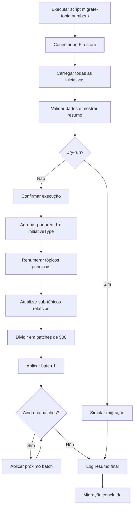
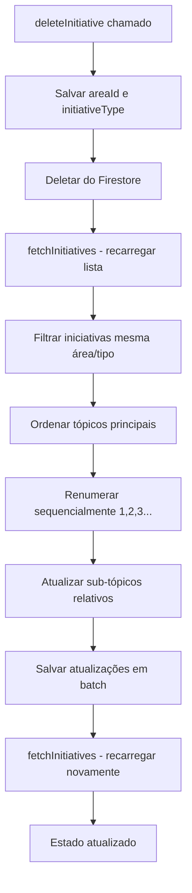

# Numeração de Iniciativas por Área e Tipo

## Objetivo

Alterar a numeração de iniciativas para ser sequencial por área de negócio e tipo (strategic/other), em vez de global. Cada área/tipo deve ter sua própria sequência começando em 1.

## Situação Atual

### Estrutura de Numeração

- `topicNumber` é gerado globalmente via `getNextMainTopicNumber()` em [src/contexts/initiatives-context.tsx](src/contexts/initiatives-context.tsx:466-469)
- Não considera `areaId` nem `initiativeType`
- Sub-tópicos usam formato hierárquico: "1", "1.1", "1.1.1" (baseado em `parentId`)

### Hierarquia

- Tópicos principais: `topicNumber` sem pontos (ex: "1", "2")
- Sub-tópicos: `topicNumber` com pontos (ex: "1.1", "1.2")
- Relacionamento: `parentId` conecta Initiatives filhas ao pai
- UI identifica sub-tópicos via `topicNumber.includes('.')`

## Mudanças Necessárias

### 1. Nova Função de Numeração

**Arquivo:** [src/contexts/initiatives-context.tsx](src/contexts/initiatives-context.tsx)

Criar `getNextTopicNumberForArea()` que:

- Filtra iniciativas por `areaId` e `initiativeType`
- Considera apenas tópicos principais (sem pontos)
- Retorna próximo número sequencial para aquela combinação área/tipo
```typescript
const getNextTopicNumberForArea = (
  currentInitiatives: Initiative[], 
  areaId: string, 
  initiativeType: 'strategic' | 'other'
): number => {
  const filtered = currentInitiatives.filter(i => 
    i.areaId === areaId && 
    (i.initiativeType || 'strategic') === initiativeType &&
    !i.topicNumber.includes('.')
  );
  
  if (filtered.length === 0) return 1;
  
  const numbers = filtered
    .map(i => parseInt(i.topicNumber))
    .filter(n => !isNaN(n) && n > 0);
  
  return numbers.length > 0 ? Math.max(...numbers) + 1 : 1;
};
```


### 2. Atualizar `addInitiative()`

**Arquivo:** [src/contexts/initiatives-context.tsx](src/contexts/initiatives-context.tsx:471-549)

Substituir chamada a `getNextMainTopicNumber()` por `getNextTopicNumberForArea()`:

- Linha ~476: usar nova função com `areaId` e `initiativeType` do formulário

### 4. Atualizar `bulkAddInitiatives()`

**Arquivo:** [src/contexts/initiatives-context.tsx](src/contexts/initiatives-context.tsx:562-689)

Modificar para:

- Agrupar iniciativas por área/tipo antes de processar
- Calcular `nextTopicNumber` separadamente para cada grupo
- Manter sequência correta dentro de cada grupo

### 4. Criar Script de Migração Separado

**Arquivo:** `scripts/migrate-topic-numbers.py` (ou `scripts/migrate-topic-numbers.ts`)

Criar script standalone para executar migração uma única vez:

**Funcionalidades:**

1. **Conexão ao Firestore:**

   - Usar credenciais do projeto Firebase
   - Conectar à coleção `initiatives`

2. **Carregamento de dados:**

   - Buscar todas as iniciativas
   - Ordenar por `topicNumber` atual

3. **Validações pré-migração:**

   - Verificar se há iniciativas para migrar
   - Mostrar resumo: quantidade por área/tipo
   - Opção de dry-run (simular sem salvar)

4. **Execução da migração (lógica incluída no script):**

   - Agrupar iniciativas por `areaId` + `initiativeType`
   - Separar tópicos principais e sub-tópicos
   - Ordenar tópicos principais pelo `topicNumber` atual (preservar ordem relativa)
   - Renumerar tópicos principais sequencialmente (1, 2, 3...)
   - Criar mapa `topicNumber antigo → novo` para tópicos principais
   - Reconstruir `topicNumber` de sub-tópicos usando novo número do pai
   - Retornar array de atualizações `{ id, topicNumber }`

5. **Aplicação em batch:**

   - Dividir em chunks se necessário (limite Firestore: 500 por batch)
   - Aplicar atualizações em batches sequenciais
   - Validar sucesso de cada batch

6. **Logging e confirmação:**

   - Log detalhado de cada mudança (antes → depois)
   - Resumo final: quantas iniciativas foram atualizadas
   - Confirmação manual antes de executar (exceto dry-run)

**Estrutura do script (Python exemplo):**

```python
#!/usr/bin/env python3
"""
Script de migração de topicNumbers por área e tipo.
Executa uma única vez para converter numeração global em numeração por área/tipo.
"""

import firebase_admin
from firebase_admin import credentials, firestore
from collections import defaultdict
import sys

def migrate_topic_numbers(dry_run=False):
    # 1. Inicializar Firebase
    # 2. Carregar todas as iniciativas
    # 3. Agrupar por areaId + initiativeType
    # 4. Renumerar tópicos principais
    # 5. Atualizar sub-tópicos
    # 6. Aplicar em batches
    # 7. Logging detalhado
    pass

if __name__ == "__main__":
    dry_run = "--dry-run" in sys.argv
    migrate_topic_numbers(dry_run)
```

**Uso:**

```bash
# Dry-run (simular sem salvar)
python scripts/migrate-topic-numbers.py --dry-run

# Executar migração real
python scripts/migrate-topic-numbers.py
```

**Nota:** Após executar o script uma vez, todas as novas iniciativas já usarão `getNextTopicNumberForArea()` e deleções usarão `renumberAfterDelete()`, então não há necessidade de executar novamente.

### 5. Função de Reordenação Após Deleção

**Arquivo:** [src/contexts/initiatives-context.tsx](src/contexts/initiatives-context.tsx)

Criar `renumberAfterDelete()` que:

- Recebe `areaId` e `initiativeType` da iniciativa deletada
- Identifica todas as iniciativas da mesma área/tipo (após deleção)
- Renumera tópicos principais sequencialmente (1, 2, 3...)
- Atualiza sub-tópicos relativos ao novo número do pai
- Retorna array de atualizações `{ id, topicNumber }`

**Estratégia:**

1. Buscar iniciativa deletada antes da deleção (ou receber como parâmetro)
2. Extrair `areaId` e `initiativeType` da iniciativa deletada
3. Filtrar iniciativas restantes da mesma área/tipo
4. Separar tópicos principais e sub-tópicos
5. Ordenar tópicos principais pelo `topicNumber` atual
6. Renumerar sequencialmente começando em 1
7. Criar mapa `topicNumber antigo → novo` para tópicos principais
8. Reconstruir `topicNumber` de sub-tópicos usando novo número do pai
```typescript
const renumberAfterDelete = async (
  deletedInitiative: { areaId: string; initiativeType?: 'strategic' | 'other' },
  remainingInitiatives: Initiative[]
): Promise<Array<{ id: string; topicNumber: string }>> => {
  const initiativeType = deletedInitiative.initiativeType || 'strategic';
  
  // Filtrar iniciativas da mesma área/tipo
  const sameAreaType = remainingInitiatives.filter(i => 
    i.areaId === deletedInitiative.areaId &&
    (i.initiativeType || 'strategic') === initiativeType
  );
  
  if (sameAreaType.length === 0) return [];
  
  // Separar tópicos principais e sub-tópicos
  const mainTopics = sameAreaType.filter(i => !i.topicNumber.includes('.'));
  const subTopics = sameAreaType.filter(i => i.topicNumber.includes('.'));
  
  // Ordenar tópicos principais
  mainTopics.sort((a, b) => {
    const aNum = parseInt(a.topicNumber) || 0;
    const bNum = parseInt(b.topicNumber) || 0;
    return aNum - bNum;
  });
  
  // Criar mapa de renumeração
  const topicNumberMap = new Map<string, string>();
  const updates: Array<{ id: string; topicNumber: string }> = [];
  
  mainTopics.forEach((init, index) => {
    const newNumber = (index + 1).toString();
    topicNumberMap.set(init.topicNumber, newNumber);
    updates.push({ id: init.id, topicNumber: newNumber });
  });
  
  // Atualizar sub-tópicos
  subTopics.forEach(init => {
    const parts = init.topicNumber.split('.');
    const parentOldNumber = parts[0];
    const parentNewNumber = topicNumberMap.get(parentOldNumber);
    
    if (parentNewNumber) {
      const newTopicNumber = [parentNewNumber, ...parts.slice(1)].join('.');
      updates.push({ id: init.id, topicNumber: newTopicNumber });
    }
  });
  
  return updates;
};
```


### 6. Atualizar `deleteInitiative()`

**Arquivo:** [src/contexts/initiatives-context.tsx](src/contexts/initiatives-context.tsx:744-752)

Modificar para:

1. Antes de deletar: salvar dados da iniciativa (`areaId`, `initiativeType`)
2. Deletar iniciativa do Firestore
3. Recarregar iniciativas restantes
4. Chamar `renumberAfterDelete()` com dados da iniciativa deletada e lista atualizada
5. Aplicar atualizações de renumeração em batch
6. Recarregar novamente para refletir mudanças

**Fluxo:**

```typescript
const deleteInitiative = useCallback(async (initiativeId: string) => {
  // 1. Buscar iniciativa antes de deletar
  const initiativeToDelete = initiatives.find(i => i.id === initiativeId);
  if (!initiativeToDelete) return;
  
  const { areaId, initiativeType } = initiativeToDelete;
  
  // 2. Deletar do Firestore
  const initiativeDocRef = doc(db, 'initiatives', initiativeId);
  try {
    await deleteDoc(initiativeDocRef);
    
    // 3. Recarregar para obter lista atualizada
    await fetchInitiatives();
    
    // 4. Aguardar estado atualizar e renumerar
    // (usar setTimeout ou callback após fetchInitiatives atualizar estado)
    setTimeout(async () => {
      const updatedInitiatives = initiatives.filter(i => i.id !== initiativeId);
      const renumberUpdates = await renumberAfterDelete(
        { areaId, initiativeType },
        updatedInitiatives
      );
      
      if (renumberUpdates.length > 0) {
        const batch = writeBatch(db);
        renumberUpdates.forEach(({ id, topicNumber }) => {
          const docRef = doc(db, 'initiatives', id);
          batch.update(docRef, { topicNumber });
        });
        
        await batch.commit();
        await fetchInitiatives();
      }
    }, 100);
    
  } catch (error) {
    console.error("Error deleting initiative: ", error);
  }
}, [initiatives, fetchInitiatives]);
```

**Nota:** A abordagem com `setTimeout` pode ser melhorada usando estado ou callback. Considerar usar `useState` para rastrear quando `fetchInitiatives` completa.

## Fluxo de Migração (Script)



## Fluxo de Deleção e Reordenação



## Detalhes de Implementação

### Preservação de Hierarquia

- Sub-tópicos mantêm estrutura relativa: se pai "5" vira "1", "5.1" vira "1.1"
- Mapeamento baseado em `topicNumber.split('.')[0]` para identificar pai
- Sub-tópicos de níveis mais profundos (ex: "1.1.1") preservam estrutura completa

### Execução da Migração

**Migração é executada uma única vez via script separado:**

- Script `migrate-topic-numbers.py` (ou `.ts`) executa manualmente
- Após migração bem-sucedida, não há necessidade de executar novamente
- Novas iniciativas já usam `getNextTopicNumberForArea()` (numeração correta desde o início)
- Deleções já usam `renumberAfterDelete()` (mantém sequência correta)

**Validações no script:**

- Verificar se há iniciativas para migrar
- Mostrar resumo antes de executar
- Opção de dry-run para testar sem salvar
- Logs detalhados de cada mudança

### Tratamento de Erros

- Migração falha: continuar com dados originais, logar erro
- Batch muito grande: dividir em chunks se necessário
- Dados inconsistentes: manter `topicNumber` original com warning

## Validação

### Cenários de Teste

1. **Migração inicial (via script):**

   - Executar script `migrate-topic-numbers.py`
   - Iniciativas existentes são renumeradas corretamente
   - Sub-tópicos mantêm hierarquia relativa
   - Validar com dry-run antes de executar

2. **Nova iniciativa:**

   - Área BI, tipo strategic → recebe "1" (se primeira)
   - Segunda iniciativa mesma área/tipo → recebe "2"
   - Área diferente → recebe "1" (sequência própria)

3. **Bulk import:**

   - Múltiplas iniciativas mesma área/tipo → numeração sequencial
   - Diferentes áreas/tipos → sequências independentes

4. **Sub-tópicos:**

   - Após migração, "5.1" vira "1.1" se pai "5" vira "1"
   - Estrutura "1.1.1" preservada corretamente

5. **Deleção e reordenação:**

   - Área BI tem iniciativas "1", "2", "3", "4"
   - Deletar iniciativa "2" → reordenação automática
   - Resultado: "1", "2" (ex-"3"), "3" (ex-"4")
   - Sub-tópicos atualizados relativamente: "3.1" vira "2.1"

## Riscos e Mitigações

| Risco | Mitigação |

|-------|-----------|

| Migração falha e corrompe dados | Usar batch transacional, manter backup |

| Performance com muitas iniciativas | Dividir batch em chunks, processar assincronamente |

| Ordenação quebrada | Manter `orderBy('topicNumber')`, testar ordenação após migração |

| Sub-tópicos órfãos | Validar `parentId` existe antes de atualizar |

| Race condition na deleção | Usar estado ou callback para garantir fetchInitiatives completa antes de renumerar |

| Performance em deleções frequentes | Otimizar batch updates, considerar debounce se necessário |

## Arquivos Afetados

- `src/contexts/initiatives-context.tsx` (principal)
  - Adicionar `getNextTopicNumberForArea()`
  - Adicionar `renumberAfterDelete()`
  - Modificar `addInitiative()` (linha ~476)
  - Modificar `bulkAddInitiatives()` (linha ~591)
  - Modificar `deleteInitiative()` (linha ~744)
  - **NÃO adicionar** função de migração (lógica fica apenas no script)

- `scripts/migrate-topic-numbers.py` (novo)
  - Script standalone para executar migração uma única vez
  - Conectar ao Firestore
  - **Implementar lógica de migração completa** (agrupamento, renumeração, atualização de sub-tópicos)
  - Aplicar atualizações em batches
  - Logging e validações

## Notas de Implementação

- Manter `getNextMainTopicNumber()` como fallback ou remover após migração
- **Migração é executada uma única vez via script separado** - não há necessidade de flag ou detecção automática
- Script de migração deve ter:
  - Validações robustas antes de executar
  - Opção de dry-run para testar
  - Logs detalhados de cada mudança
  - Confirmação manual antes de aplicar
  - Tratamento de erros com rollback se possível
- Após migração executada, todas as novas iniciativas já usam numeração correta por área/tipo
- Testar script com dados reais em ambiente de desenvolvimento antes de executar em produção
- Considerar fazer backup do Firestore antes de executar migração